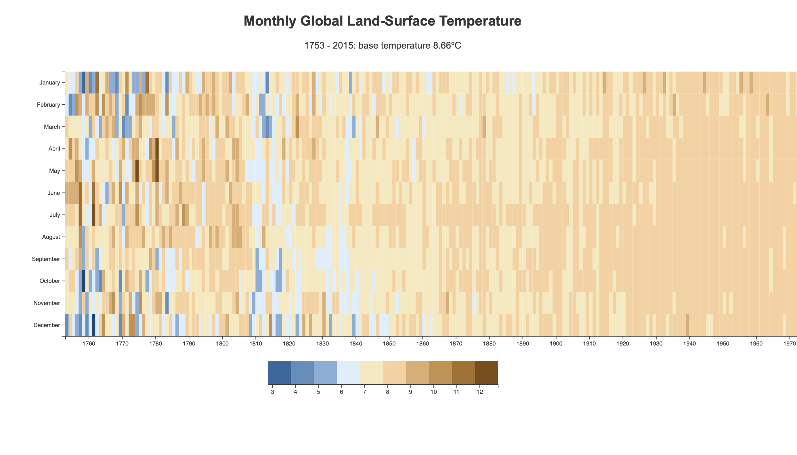

## Heat Map chart wit D3
Visualizing Monthly Global Land-Surface Temperature with D3

**API URL**
`"https://raw.githubusercontent.com/freeCodeCamp/ProjectReferenceData/master/global-temperature.json"`

Opn the project in [Codepen](https://codepen.io/Darbaz/pen/bGEyLPQ)

### Usage
**dev** to run the dev env.

